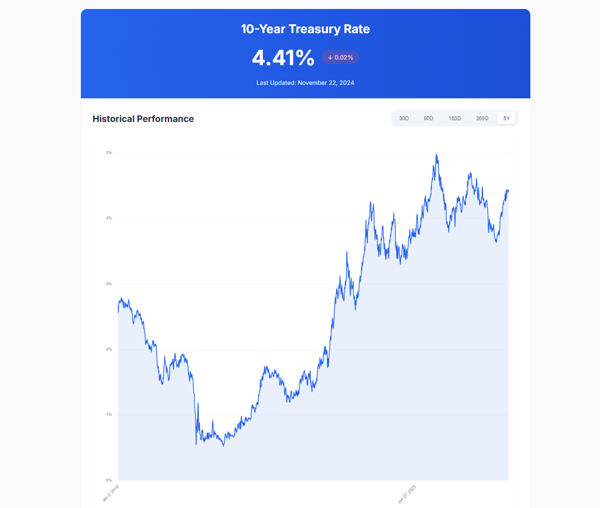

# 10-Year Treasury Rate Tracker

A real-time web application that tracks and visualizes the 10-year U.S. Treasury rates. Built with Next.js 14 and Chart.js, this tool provides financial professionals and analysts with up-to-the-minute treasury rate data and historical trends.



## Features

- Real-time 10-year Treasury rate display with automatic 5-minute updates
- Interactive historical rate chart with multiple time periods:
  - 30 days
  - 90 days
  - 180 days
  - 365 days
  - 5-year view
- Dynamic rate change visualization with increase/decrease indicators
- Responsive design optimized for desktop and mobile devices
- Clean, modern financial dashboard interface

## Tech Stack

- **Frontend Framework**: Next.js 14
- **UI Library**: React 18
- **Data Visualization**: Chart.js with react-chartjs-2
- **Date Handling**: date-fns
- **Language**: TypeScript
- **Styling**: Pure CSS with modern features

## Getting Started

1. Clone the repository:
```bash
git clone https://github.com/tony-42069/10-year-treasury-tracker.git
cd treasury-rate-tracker
```

2. Install dependencies:
```bash
npm install
```

3. Run the development server:
```bash
npm run dev
```

4. Open [http://localhost:3000](http://localhost:3000) with your browser to see the result.

## Data Source

Data is sourced directly from the U.S. Department of the Treasury's official website. The application fetches and processes:
- Real-time 10-year Treasury rates
- Historical data from 2019-2024
- Automatic updates every 5 minutes
- CSV format data parsing and transformation

## Future Enhancements

### Core Features
- [ ] Server-side data caching for improved performance
- [ ] Export functionality for data analysis
- [ ] Additional time period options
- [ ] Comparative analysis with other financial metrics
- [ ] Advanced statistical indicators

### Integration Plans

#### Does My Deal Pencil Integration
The Treasury Rate Tracker will be integrated with the Does My Deal Pencil tool to provide:
- Real-time rate data for deal calculations
- Historical rate context for deal analysis
- Rate forecasting for future deal scenarios
- Deal sensitivity analysis based on rate changes
- Custom rate alerts for deal monitoring

### Technical Improvements
- [ ] Implement server-side rendering for better SEO
- [ ] Add comprehensive error handling and fallbacks
- [ ] Create unit and integration tests
- [ ] Optimize data fetching with incremental updates
- [ ] Add PWA support for offline functionality

### UI/UX Enhancements
- [ ] Dark mode support
- [ ] Customizable chart views
- [ ] Rate change notifications
- [ ] Mobile-optimized touch interactions
- [ ] Accessibility improvements

## Contributing

We welcome contributions! Here's how you can help:

1. Fork the repository
2. Create your feature branch (`git checkout -b feature/AmazingFeature`)
3. Commit your changes (`git commit -m 'Add some AmazingFeature'`)
4. Push to the branch (`git push origin feature/AmazingFeature`)
5. Open a Pull Request

For major changes, please open an issue first to discuss what you would like to change.

## License

This project is licensed under the MIT License - see the [LICENSE](LICENSE) file for details.

## Acknowledgments

- Data provided by the U.S. Department of the Treasury
- Built with Next.js and React
- Chart visualization powered by Chart.js
- Special thanks to the open-source community

## Contact

Project Link: [https://github.com/tony-42069/10-year-treasury-tracker](https://github.com/tony-42069/10-year-treasury-tracker)
